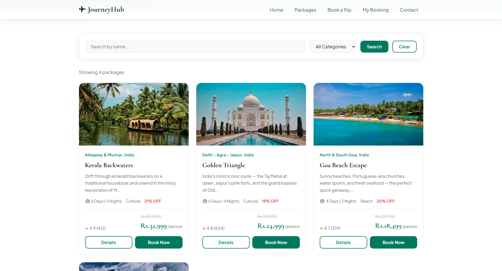
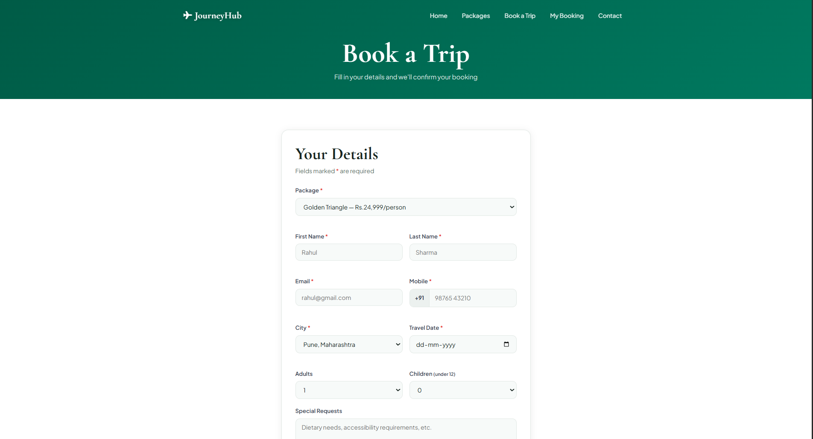
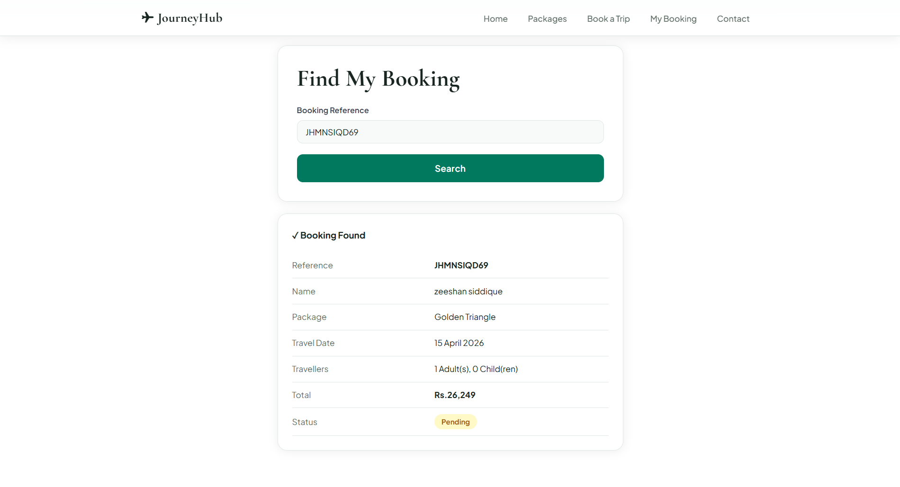
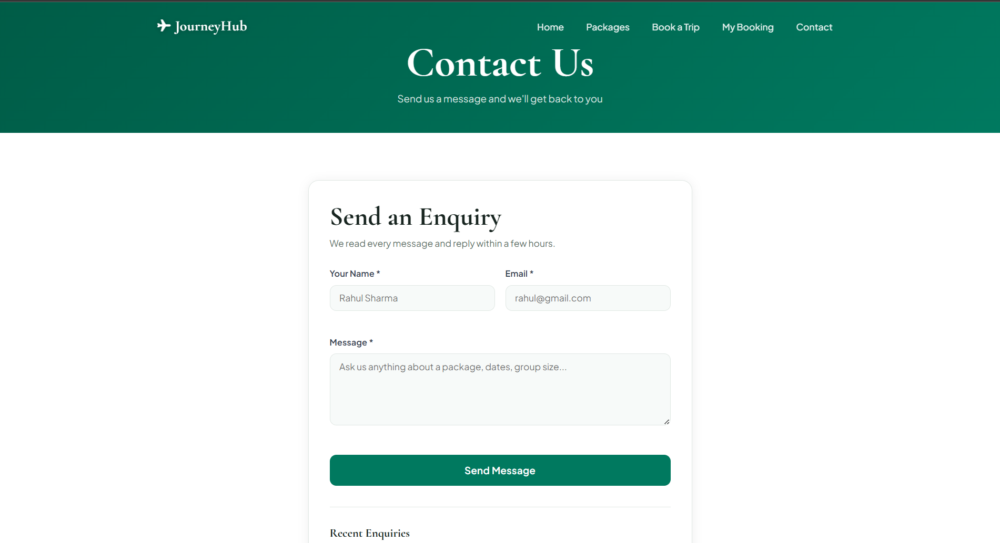

# JourneyHub - Travel Agency Website

## Description

This is a server-side web application developed using Node.js, Express, and MongoDB.

It allows users to:

* Browse handpicked travel packages across India
* Book a trip by filling a booking form
* Track their booking using a reference number
* Send enquiries via the contact form

---

## Features

* 4 curated travel packages with details, highlights and pricing in INR
* Booking form with client-side and server-side validation
* Unique booking reference number generated for each booking
* Booking lookup system to track trip details
* Contact/enquiry form with recent enquiries display
* Auto-seeding of packages on first run
* All data stored persistently in MongoDB
* Clean and responsive UI with subtle animations

---

## Tech Stack

* Node.js
* Express.js
* MongoDB (mongodb driver)
* HTML, CSS, JavaScript

---

## How to Run

1. Clone the repo:

```
git clone https://github.com/SwayamMandhani06/JourneyHub.git
```

2. Install dependencies:

```
npm install
```

3. Add `.env` file:

```
MONGO_URI=mongodb://localhost:27017
PORT=3000
```

4. Start the server:

```
node server.js
```

5. Open browser:

```
http://localhost:3000
```

---

## Screenshots







---

## Assignment Info

Full Stack Development Lab Assignment 5
PCCOE

---

## Author

Swayam Mandhani
