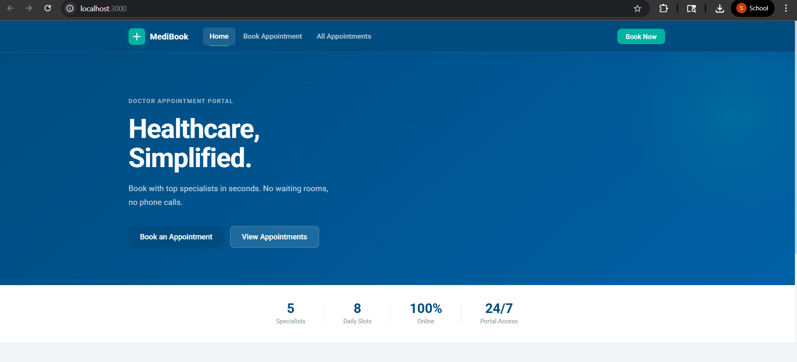
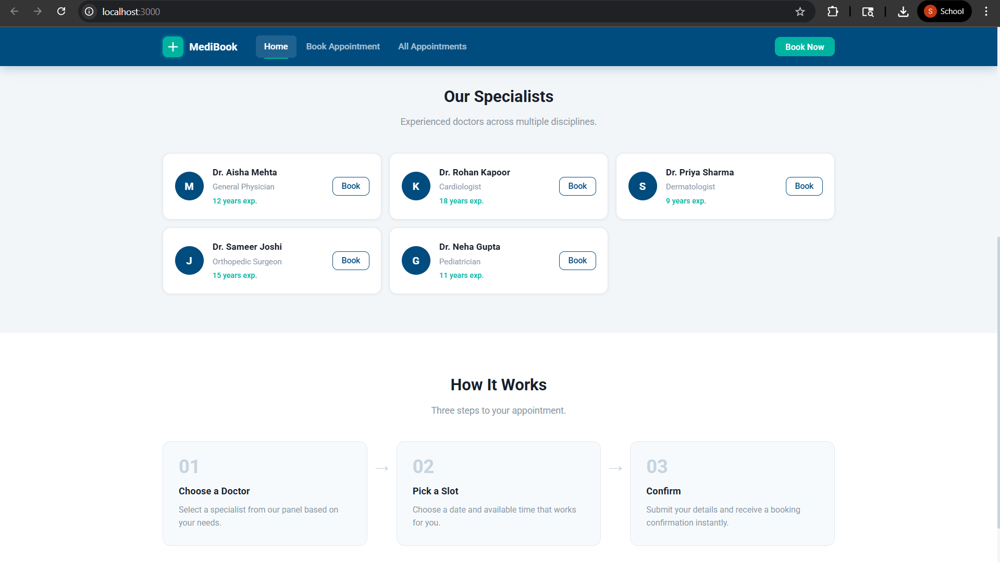
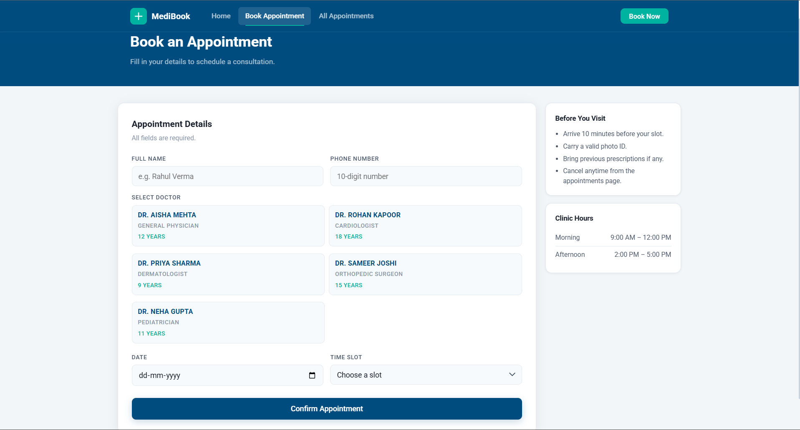
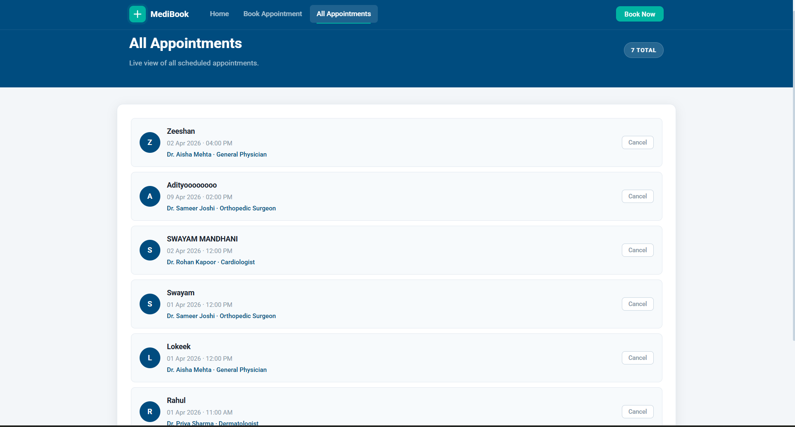
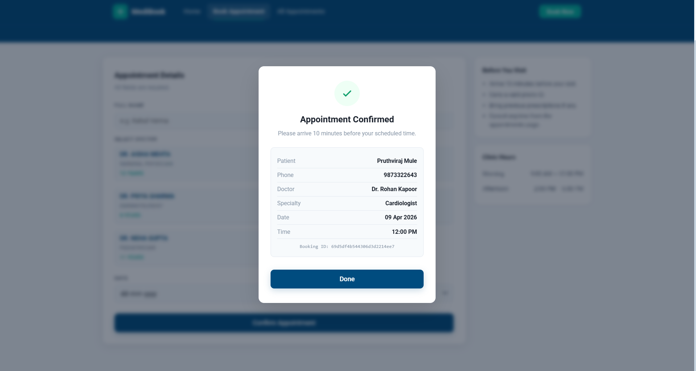

# Doctor Appointment Booking System

## Description
This is a full-stack web application developed using Node.js, Express, and MongoDB.

It allows users to:
- View doctors
- Book appointments
- Check availability
- Cancel bookings

## Features
- REST API using Express.js
- MongoDB database integration
- Slot conflict detection
- Responsive frontend UI
- Appointment confirmation system

## Tech Stack
- Node.js
- Express.js
- MongoDB
- HTML, CSS, JavaScript

## How to Run

1. Clone the repo:
   git clone https://github.com/your-username/assignment-6.git

2. Install dependencies:
   npm install

3. Add `.env` file:
   MONGO_URI=your_mongodb_connection_string

4. Run server:
   node server.js

5. Open browser:
   http://localhost:3000

## Screenshots
      
## Assignment Info
Full Stack Development Lab Assignment 6  
PCCOE  
