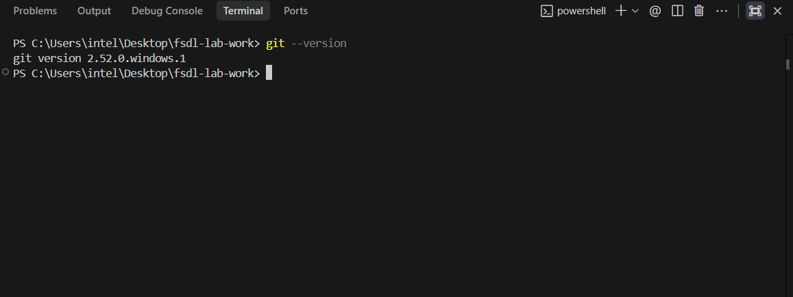
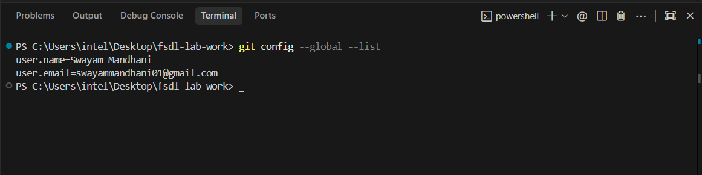
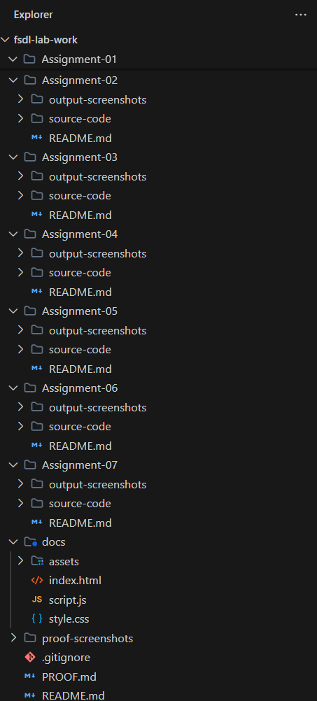
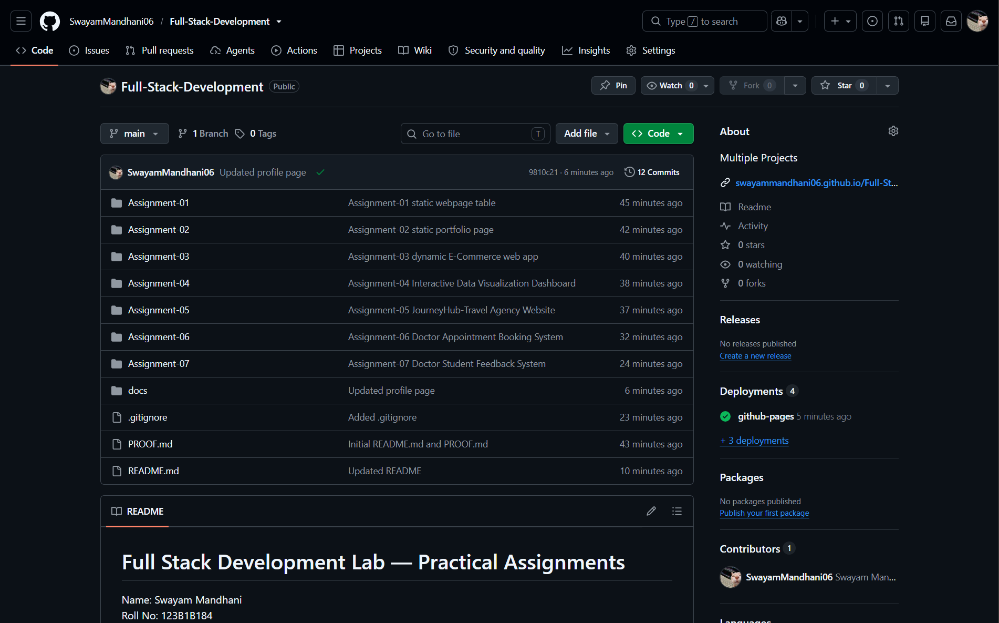
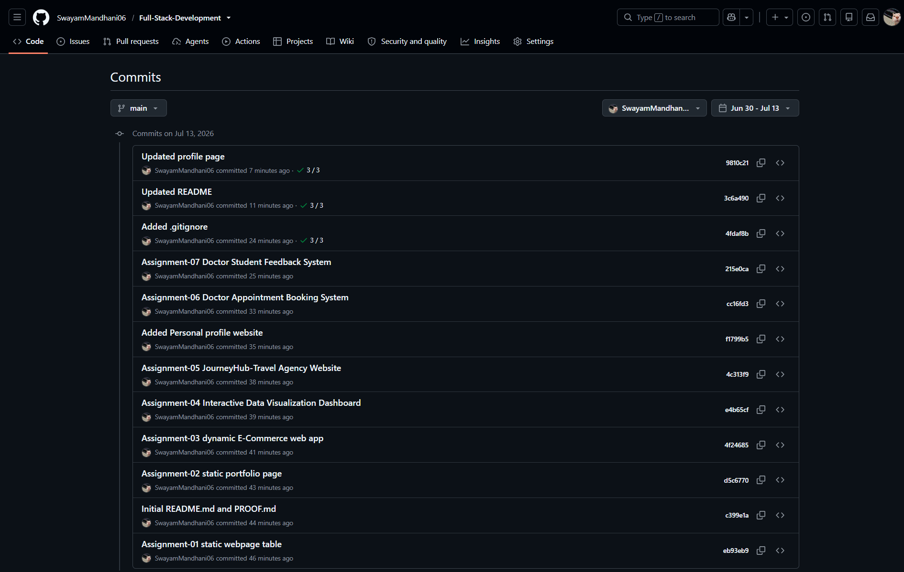
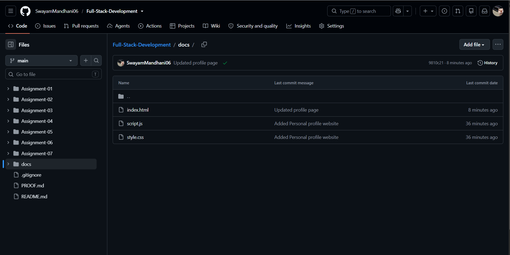
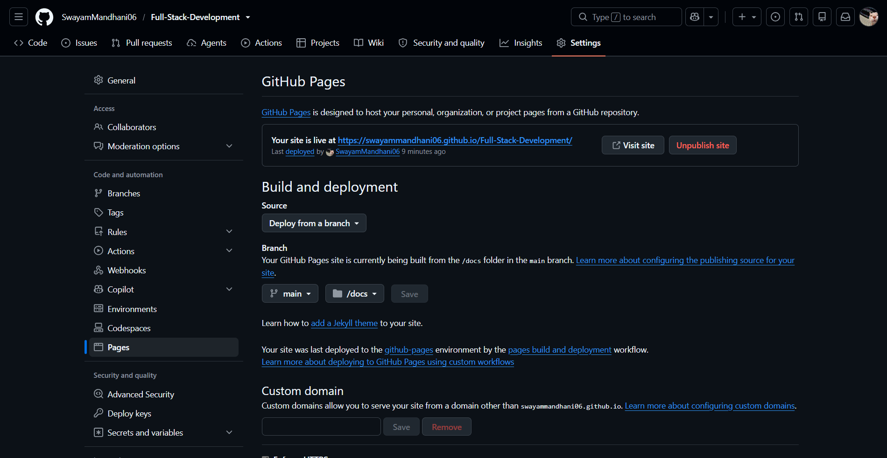
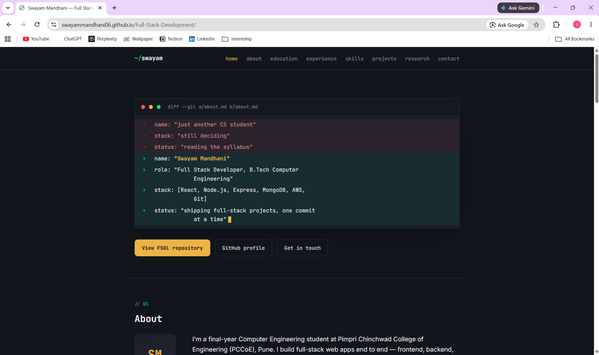

# Proof of Implementation

| No. | Proof Required | Status |
|---|---|---|
| 1 | `git --version` screenshot |  |
| 2 | `git config --global --list` screenshot |  |
| 3 | Local folder structure |  |
| 4 | Public GitHub repository page |  |
| 5 | Commit history with 5+ commits |  |
| 6 | Website files inside `docs/` folder |  |
| 7 | GitHub Pages settings |  |
| 8 | Live hosted website |  |

